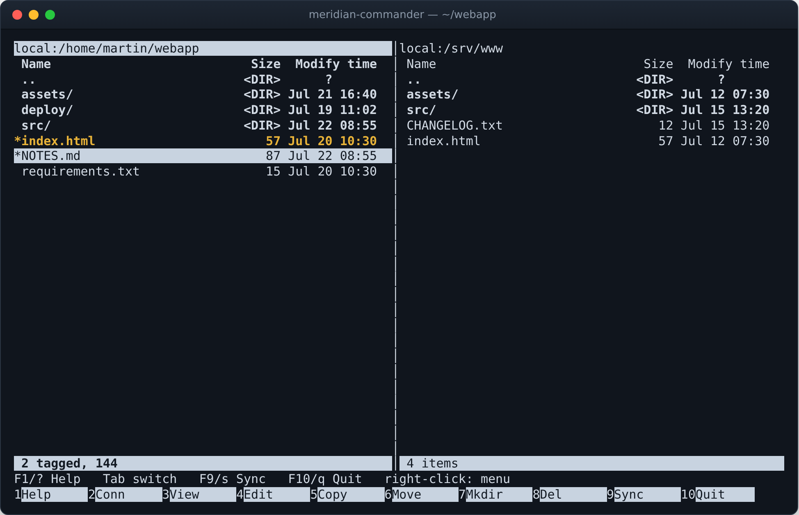

# Meridian Commander

*The meridian is noon — the other end of the clock from midnight.*

A two-pane terminal file manager with the keys of **Midnight Commander** and
the face of **Turbo Vision**, written in pure Python. It browses local **and
networked** locations (SFTP/SSH/FTP), copies and moves files between the two
panes regardless of where each side lives, synchronizes directories so both
panes hold the newest version of every file, and ships with a built-in file
viewer and editor — plus browsers for `.xlsx` grids, `.docx` documents,
`.pptx` slides, rendered Markdown, colour images, PDFs, and zip/tar archives
navigable as directories.



## Quick start

```bash
pip install "meridian-commander[ssh]"
meridian
```

With no arguments the left pane opens in the current directory and the right
pane in your home directory. Press **F1** for help, **F2** to connect a pane
to a remote location, **Tab** to switch panes, and **F10** to quit.

## This manual

- **[Installation](installation.md)** — the extras, pipx, and what to do when
  `meridian` is "command not found".
- **[Usage](usage.md)** — the complete guide: connecting to a remote location,
  presets, the archive and document browsers, images, PDFs, and the full
  **key-binding reference**.
- **[Look and feel](look-and-feel.md)** — the colour schemes and what happens
  on a terminal without them.
- **[Configuration](configuration.md)** — `config.ini` and where it lives.
- **[Plug-ins](plugins.md)** — what ships, and how to write one.
- **[Data tools tutorial](DATA_TOOLS.md)** — a walkthrough of profiling,
  cleaning and building a dataset.
- **[How copying and synchronizing work](transfers.md)** — the second channel,
  and what the sync planner decides.
- **[Development](development.md)** — the architecture, and what CI checks.
- **[Plug-in API reference](api.md)** — `PluginContext`, `PanePlugin` and
  `InputOutputPlugin`.

## Elsewhere

- **[Website](https://martingallagher-code.github.io/meridian_commander/)** —
  screenshots and a tour.
- **[Source on GitHub](https://github.com/MartinGallagher-code/meridian_commander)**
  — issues, and how to contribute.
- **[Changelog](https://github.com/MartinGallagher-code/meridian_commander/blob/main/CHANGELOG.md)**
  — what changed in each release.
- **[PyPI](https://pypi.org/project/meridian-commander/)** — releases.

```{toctree}
:maxdepth: 2
:hidden:

installation
usage
look-and-feel
configuration
plugins
DATA_TOOLS
transfers
development
api
```
